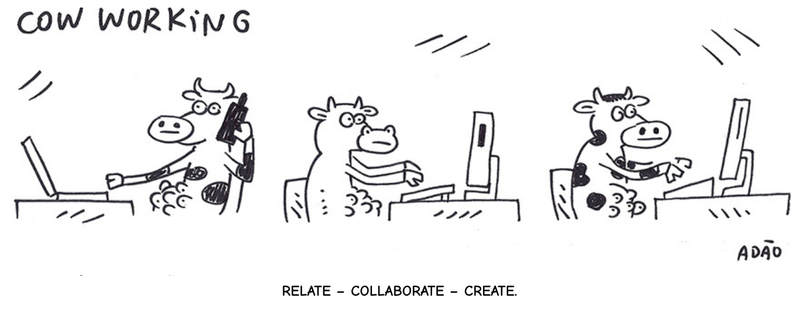

Repositório destinado ao projeto da disciplina Princípios de Desenvolvimento Web.

 

# Coooworking

O Coooworking é uma plataforma para o gerencialmento de coworking, permitindo ao usuário
a possibilidade de reservar ou se juntar a um workplace previamente criado e ao gestor
permite a chance de gerenciar workplaces e suas características

## Tecnologias
- [HTML 5](https://developer.mozilla.org/pt-BR/docs/Web/HTML)
- [CSS 3](https://developer.mozilla.org/pt-BR/docs/Web/CSS)
- [TypeScript](https://www.typescriptlang.org/)
- [React](https://pt-br.reactjs.org/)
- [Node.js](https://nodejs.org/en/)

### Autor
Desenvolvido por Yovany Cunha. Entre em contato! 👋🏽 

